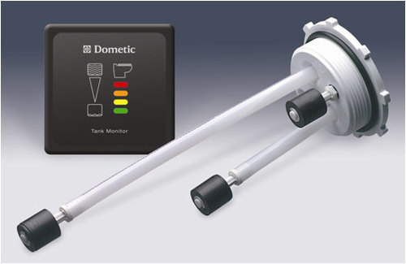
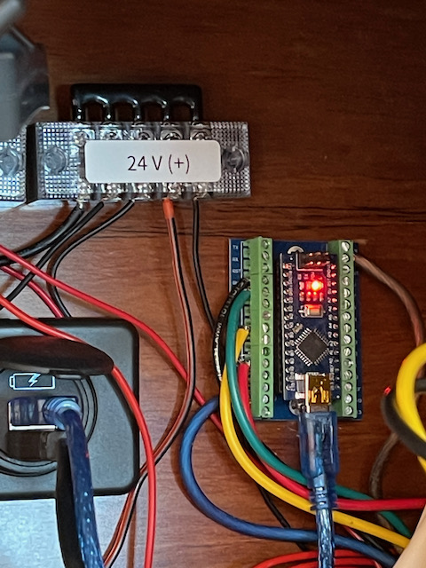

# Arduino Code to Replace Dometic Gauges

This repository contains a simple Arduino code to replace Dometic gauges, like the one shown here:

It takes green, orange and red inputs on pins 2, 5 and 8 respectively and outputs a variable voltage on pin 11. This output can be used with monitors like Simarine Pico via their ST107 tank sensor. It can be adapted to be used on different applications.

This code should work different Arduino models but the easiest may be the Arduino Nano with [a shield like this](https://www.amazon.com/dp/B012EQSYE6).

Belowis the installation I have. Black, green, yellow and red wires go to the sensor; blue and brown wires go to positive and ground terminals of Simarine ST107 sensor.

